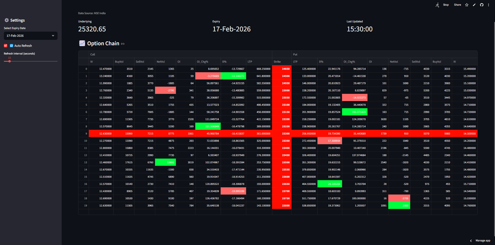

# 📊 NIFTY Option Chain (Live)

A live NIFTY option chain dashboard built with Streamlit, fetching data directly from NSE India.

## Features

- Displays live NIFTY option chain data.

- Shows Call and Put options with key metrics:

  - Last Price (LTP)

  - Implied Volatility (IV)

  - Open Interest (OI) and % change

  - Buy/Sell volumes and Net volume

  - % Change (D%)

- Highlights ATM strike and Strike column for easy reference.

- Supports auto-refresh with adjustable interval.

- Multi-level table headers for Call / Strike / Put grouping



## Setup & Installtion

Make sure you have the latest version of Python installed.

```bash
git clone https://github.com/Talkative-Banana/NSE-Option-Chain.git
```
CD into the directory

```bash
python3 -m venv venv
. venv/bin/activate
pip install -r requirements.txt
```

## Running The App

```bash
streamlit run NSE.py
```
